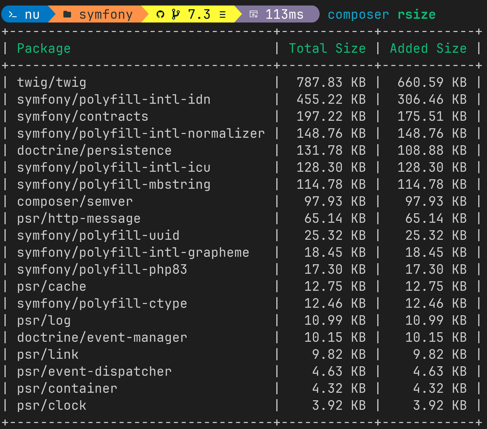

# composer-rsize
This composer plugin shows the size of your dependencies including transitive dependencies.
It also shows how much space you can save by removing each dependency by determining which
packages are needed by your other dependencies.



## Installation
```bash
composer global require julianve/composer-rsize
```

## Usage
```bash
composer rsize [--format=json] [--dev] [package]
```

### Arguments
- `package`: The package to analyze. If not provided, the root package is analyzed.

### Options
- `--format`: Format of the output: `json` or `text` (default)
- `--dev`: Include dev dependencies
